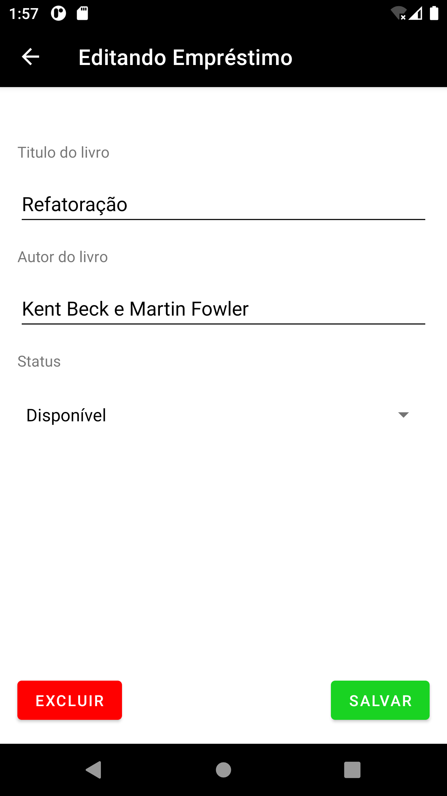

# Biblioteca

## Projeto final da disciplina de Desenvolvimento de Aplicativos Móveis do IFMG

### Esse aplicativo é um MVP para a ideia do grupo de desenvolver um gerenciador para bibliotecas e foi desenvolvido em Java, ele possui as opções de cadastrar um empréstimo e consultar o acervo.

  
  
  
  
  

Esse projeto foi desenvolvido por:
| Arthur do Carmo | Gabriel de Paula | Marcelo Paulino | Matheus Henrick | Tiago Ernandes |  
| arthurdocarmodf@hotmail.com | cerogabgio@gmail.com | ppaulinosimoess@gmail.com | mhenrickd@gmail.com | tiagoestevam7@gmail.com |
